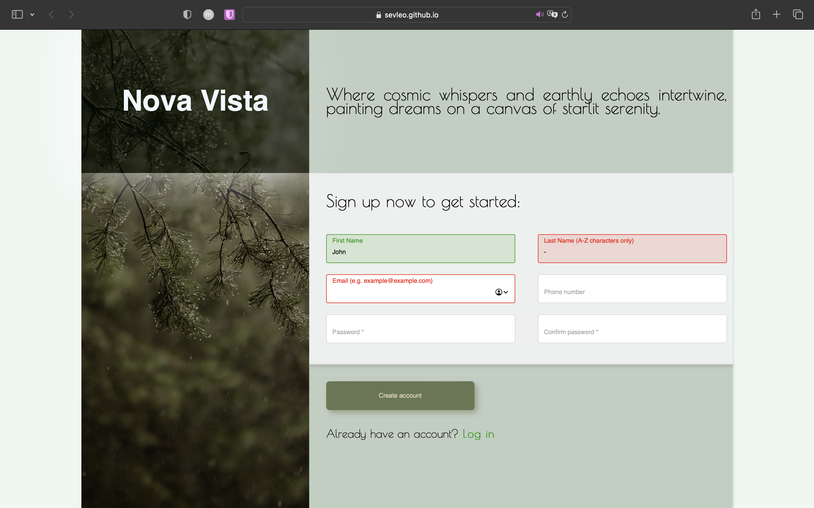

# Sign Up Form

Implementation of custom sign up form with custom data validations, highlightning valid/invalid data entry and providing helpers pup-ups to the users.

## Table of Contents

- [Demo](#demo)
- [Technologies](#technologies)
- [Contributing](#contributing)
- [License](#license)
- [Acknowledgements](#acknowledgements)

## Demo

You can view the project at [Sign-up Form Demo](https://sevleo.github.io/Sign-up_Form/).

## Technologies

- Vanilla JS
- CSS
- HTML

## Contributing

 Contributions are welcome! If you'd like to contribute to this project, please follow these guidelines:

 1. Fork the repository.
 2. Create a new branch for your feature or bug fix.
 3. Make your changes and commit them.
 4. Push your changes to your fork.
 5. Create a pull request.

## License

 This project is licensed under the [MIT LICENSE](./LICENSE)

## Acknowledgements

Background picture credit to Valeria Reverdo https://unsplash.com/photos/a-bird-perched-on-a-tree-branch-in-the-rain-cWciza5SIpA